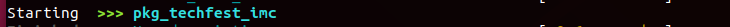
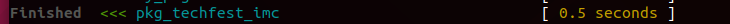
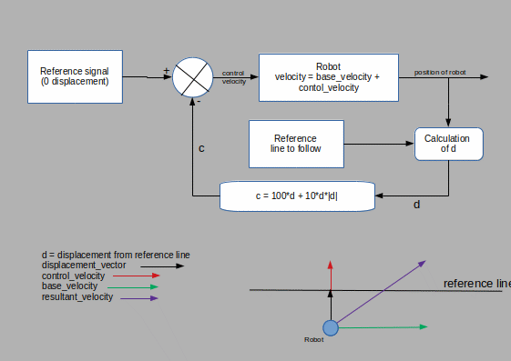
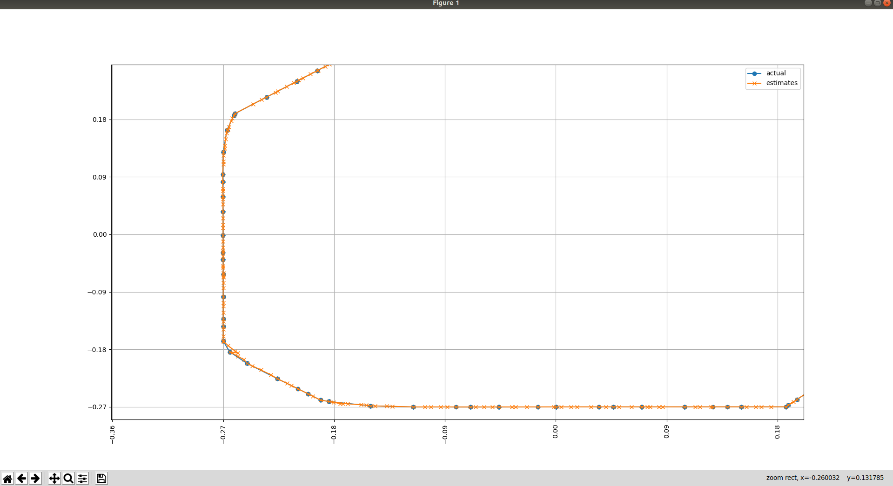
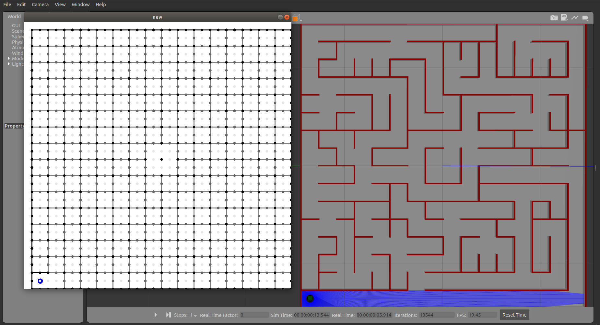
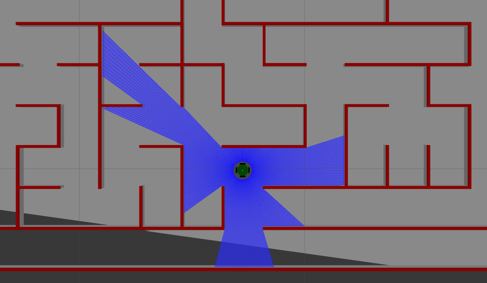
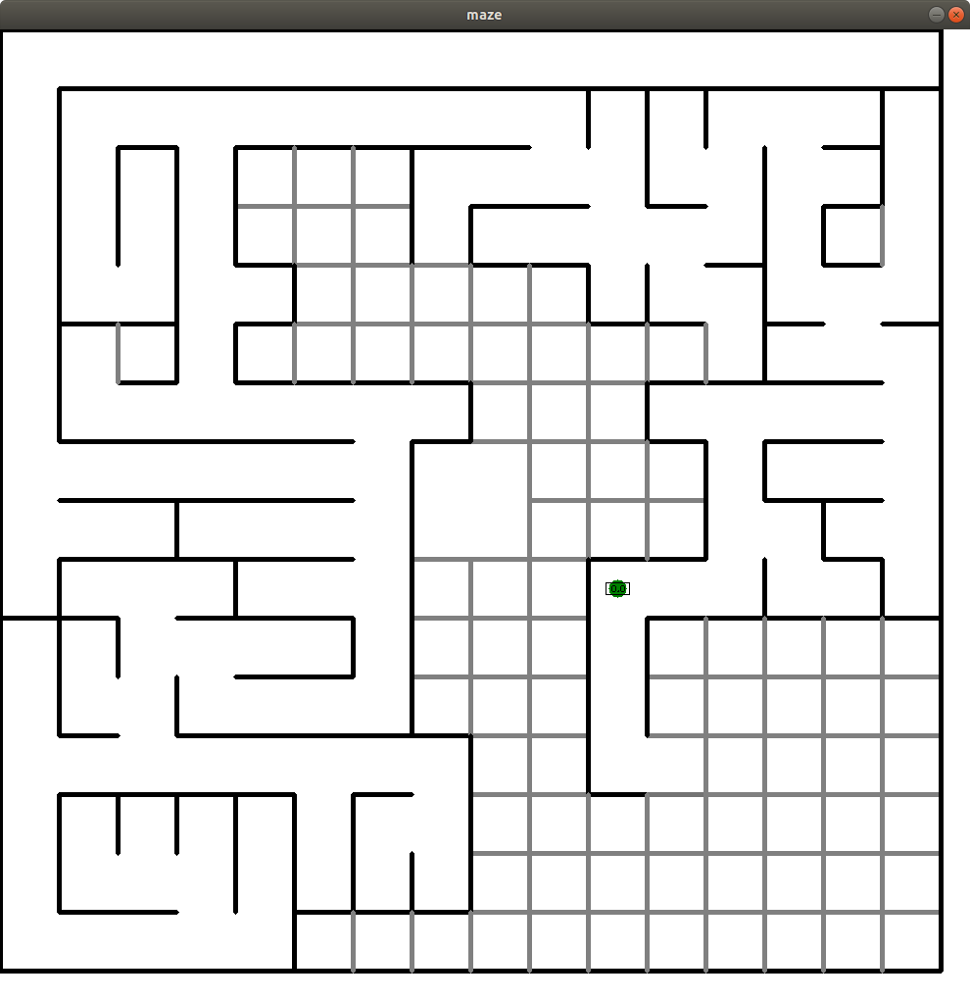
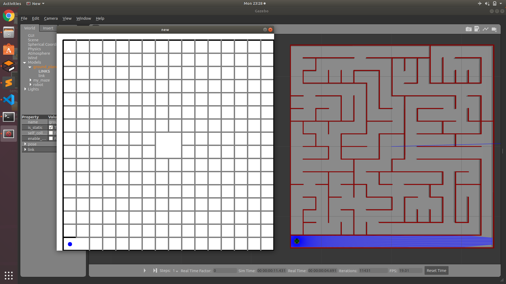
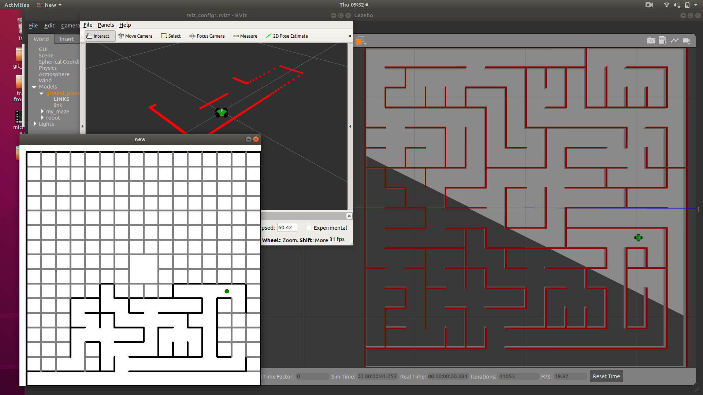

# Link to the video on YouTube
https://youtu.be/cBlPoZ9ovlw

---
---

# To quickly get started
1. Download the zip file and move the folder pkg_tf_micromouse in your ROS workspace folder.  
Your workspace directory should look like
    ```bash
    |-- your_workspace  
        |-- build  
        |-- devel  
        |-- logs  
        |-- src   
            |-- pkg_tf_micromouse    
            |-- your_other_packages
      ```
2. Run the following command.
    ```bash
    catkin build # if you used build while making the ROS workspace 
    ```
    **or**
    ```bash 
    catkin make # if you used make while making the ROS workspace
    ```
2. Run the following commands in your terminal, one by one.
    ```bash
    source devel/setup.bash
    roslaunch pkg_techfest_imc final.launch
    ```
3. Now the gazebo, rviz and an OpenCV window should open and after a while the robot will start its run in the maze.
---
---

# Some problems based on system

## 1. Problem
Robot shows a play pause like motion like it moves a little and halts for a short duration.
## -> Solution
1. Go to main.py file in /src/MC-215353-techfest-micromouse-submission/techfest-micromouse/pkg_tf_micromouse/scripts directory
2. Change the variable value from True to False on line number 18
    ```python
    map_display_needed = False
    ```

## 2. Problem
Script main.py throws an error (IndexError: list index out of range)
## -> Solution
Increase the value of argument passed to time.sleep in line number 195 of main.py  
If problem still persists uncomment the lines in line number 191 and 172

---
---

# How to use the package

## Steps to be done for the first time
* Download the package and move it to your ROS workspace.
* Open your terminal.
* Change directory to your ROS workspace.
* Build the package to let your ROS environment know about the package by using catkin build 
    ```bash
    catkin build
    ```
* After catkin build make sure the concerned package started  
  
 and finished successfully.  

* Make the main.py file, in scripts folder, executable
    ```bash
    chmod +x src/pkg_tf_micromouse/scripts/main.py
    ```
* Source your environment
    ```bash
    source devel/setup.bash
    ```


## Steps to run the robot in maze
* After sourcing your environment, run the below command
    ```bash
    roslaunch pkg_techfest_imc final.launch
    ```
* Now you should see a Gazebo window opening and after a while, robot should start it's run.
* After the run is complete and robot has halted at centre, you can kill the process by Ctrl+C in your terminal.

## Steps to use different maze from those available in world folder
### Method 1: Passing the name of world file as argument from terminal while launching the final.launch file  
```bash
roslaunch roslaunch pkg_techfest_imc final.launch maze:=test4
```
```bash
roslaunch roslaunch pkg_techfest_imc final.launch maze:=test2
```

### Method 2: editing the gazebo.launch file
* Open pkg/launch/gazebo.launch file
* Replace the world name under world tag, with the world you want from those available in world folder.
* Available world files are
  * arena.world
  * test.world
  * test1.world
  * maze.world
* Run the final.launch file.
  ```bash
  roslaunch pkg_techfest_imc final.launch
  ```

**For making a custom maze you can follow the instructions in gmaze repository.**

---
---
# About the robot
Structure
* It is a 4 wheeled holonomic drive robot.
* Wheels are arranged at (n*90)° angle at 4 sides of a circular chasis. n = [0, 3]

Sensors
* In the centre of chasis there is a 360° laser sensor at a height for detecting the distance of objects in surrounding.
  * It sends 361 samples corresponding each degree from 0° to 360°
  * Hence separation of each sample is 1°

* The robot has an odometery node that sends the robot's
  * Position
    * Linear: x, y, z spatial co-ordinates
    * Angular: roll, pitch, yaw
  * Velocity
    * Linear: along x, y, z spatial axis
    * Angular: about x, y, z spatial axis
---
---
# Locomotion and it's controller

Go through the robot class for the clear understanding of below content.  
Robot class object is a representation for actual robot in code.  
Hereafter, bot means robot class object.  
```python
bot = robot()
```

The robot class has some functions that can be used to easily move the robot, get the reads from sensors and perform other tasks.

## Locomotion

For moving the robot at certain speed 
* Store the speed in a rospy data type called twist 
* Publish this twist message on a topic called /odom.
* The planar motion plugin used for robot, gets the message from this topic and moves the robot accordingly.
* move function in robot class takes in the x and y linear velocities and z angular velocity as arguments to move the robot.

## Algorithm

For locomotion, bot uses the chain (a list).  
Chain contains the list of x-y coordinates, so it is a list of tuples of size 2 each.

**How?**
1. bot looks at the first element in chain and considers it as it's previous position.
1. Then it looks at 2nd element in chain and considers it as the position where it has to go.
1. The bot has to travel between these points.
1. Now, controller provides the calculated commands for locomotion.
1. These commands are such that the bot should follow the imaginary line connecting the previous position to next position.
1. Controller takes in the current position and velocity of robot for calculation of commands, so that if the robot is misaligned or displaced it should come back to desired path and orientation.
1. This makes a closed loop feedback system for locomotion.

## Controller
1. Draw a ray from previous position to next position in chain list.
1. Now treating the location of robot as a point, a perpendicular vector is drawn from this point to the line.
1. This vector (say $\bar{v}$ ) is called the displacement vector of robot from line.
1. Based on this vector $\bar{v}$, correction command is generated.
> $\bar{correctionCommand}$ = 10*$\bar{v}$ + 100*$\bar{v}$*|$\bar{v}$|
5. This $\bar{correctionCommand}$ is used to generate a control command.
> $\bar{controlCommand}$ = $\bar{referenceVelocity}$ - $\bar{correctionCommand}$
5. The robot is not supposed to turn (change yaw) so the yaw doen't change ideally, but it does, hence the vector is rotated accordingly before calculating the control command.
1. This command is then sent for execution.




**Functions involved in the process are**
* *robot.controller* in main.py
* *robot.transform_wrt_orientation* in main.py
* *get_displacement_vector* in helper.py

## Problem

|Parameters |Values|
|---|---|
|Odometry update rate | 20 Hz |
|Laser update rate| 20 Hz |
|Speed of robot| 0.35 m/s |

* The robot trvelled an average distance of **3cm between two updated consecutive reads from odometry**.
* Frequency of generation of control command (program loop) is much higher than that of sensors' reads.
* That means the control command in this interval (between two reads) was based on a reading corresponding to position at passed time step.
* Hence the motion of robot was not good enough to get a **safe clearance from walls** during turns.

So increasing the odometry update rate was one option, but this caused a mismatch between the reads of odometry and laser required for detecting the walls. So laser reads was also required to be increased.

Due to this the computational load increases hence the update rates were restricted as follows
|Parameters |Values|
|---|---|
|Odometry update rate | 30 Hz |
|Laser update rate| 30 Hz |
|Speed of robot| 0.35 m/s |

But the problem of slower updates is yet to be tackled to achieve a well controlled locomotion.

To solve this problem the **concept of observer** from control system design is used.
* During the interval between two updated reads the position and velocity of robot is estimated using the last updated read from odometry and the velocity commanded previously.
> new position = last updated position + (velocity commanded) * (time passed since last updated read)


The figure shows the marks of actual reads (blue circles) from odometry and estimated positions (orange crosses).

---
---

# Making the map of maze

## How the map is stored
* Maze is made up of 16x16 same sized cells.
* An array of 33x33 elements (representated by dots in image) stores the information if wall is present or not at any location, in terms of probabilty of absence of wall. (In the program, this array is named "point" under class maze)
* 0 and 1 indicates presence and absence of wall respectively.


* Circles in the image window "new" correspond to elements in 33x33 memory locations and their color corresponds to the value stored there.

> darker color --> lesser value --> lesser the probability of absence of wall --> more the confidence in presence of wall  
vice versa for lighter color

* Some points are already completely black (i.e borders) while some are completely white (i.e near centre) of maze as it is known beforehand (mentioned in rulebook).  

## How the map is made during exploration
Technique used here is based on the principle of mapping and high school geometry of lines.  
Sensor used is 360 laser sensor.  
Function that performs this task is update() from maze class. This function takes in the position of robot and the 361 laser reads.


### Algorithm
* Initially at all the positions, presence of wall is not known.
* So it is logical to initialize all the elements of point array with the value 0.5
* That is, presence or absence of wall is equally likely, before the robot starts exploration.

Working of update function
* Let us take 2 samples corresponding to 0° and 180° from laser
* Using the distance of obstacle from read corresponding to 0° and position of robot, position of obstacle detected at 0° can be determined (say (x0, y0))
> __l = laser read corresponding to some angle (i.e distance)  
(p, q) = position of robot  
x = p + l\*cos(d)  
y = q + l\*sin(d)  
(x, y) is the position of obstacle__
* Similarly, for 180° position of robot can be determined (say (x1, y1))
* Now connect these points (x0, y0) and (x1, y1)
* All the positions of walls falling on this line indicates the absence of wall except the two end points where wall is present.
* Hence the values at the memory locations coresponding to these positions are increased by a factor like 0.05
* Value at memory locations corresponding to two end points of line where wall is present, is decreased by the same factor.
* Similarly all other reads are processed to update the existing map. 

Why values in point are changed by a factor instead of directly marking them as 0 or 1?
* Synchronization of odometry read (position) with laser reads is not guaranteed
* Practically the reads from odometry and laser are noisy.
* So drawing a conclusion, if wall is present/absent based on reads at one time step will be prone to noise
* In that case, the map made, will not be reliabe
* Confirmation by multiple reads if wall is present/absent at any location is much more reliable
* So after processing a set of reads value in the array is changed slightly by a factor like 0.05
* So, to confirm if wall is absent 10 set of reads should confirm this
> value = 0.5  
after 1st set of reads: value = value + 0.05 (now value is 0.55)  
after 2nd set of reads: value = value + 0.05 (now value is 0.60)  
.  
.  
after 10th set of reads: value = value + 0.05 (now value is 1.00)  
* To increase robustness to noise
  * Reduce the factor
  * Therefore more number of reads are required
  * This implies reduced confidence in a set of reads
  * Hence effect of noise reduces
  * Process becomes slow


---
---
# Search Algorithm

To understand the algorithm knowing what set_cost() function under maze class does is important  
This is similar to the process of setting costs of node in Dijkstra's algorithm

### Purpose of threshold argument
set_cost function sets cost only for locations (points) in map that are brighter or their value is greter than provided threshold. 

## How set_cost() works
[](for_readme/set_cost.mp4)

### Pseudo code
> function set_cost(input position=p[x, y], input threshold for color)  
> 1. initialize the array: cost = [inf], 33x33 array
> 1. cost[p[x], p[y]] = 0  ...........cost element corresponding to current position
> 1. children = [p] 
> 1. loop until children list is empty
>     * node = pop 1st element of children
>     * loop over immediate neighbours of node for whom map_point[node] > threshold 
>       * estimated_cost = cost[node] + (distance from node to neighbour)
>       * if estimated_cost < cost[neighbour]: 
>         * cost[neighbour] = estimated_cost
>         * __add this neighbour to the end of children list__
> 1. return **cost** and finish

Now the array cost contains the minimal cost of all nodes from the point passed to function  

## Approach to solve the maze
1. Imagine yourself as stuck in a maze like this.
1. You have a map that has partial information about the maze based on what you have explored till now since you started exploration form start point of maze.
1. The question is,  
**looking into the map which unexplored part of maze, you should choose to maximize chance of finding the route to centre, without having to travel much?**
1. A straight forward answer is to choice the unexplored part that is nearest to centre in terms of euclidean distance (in actual program is not euclidean distance) and it definitely has route from your current location (according to map).
1. But doing so you will have to travel a lot 

    **Explanation**: Consider 5 collinear points A, B, C, D, E. Following table shows distance of these points from centre. You are at C  
    | A | B | C | D | E |
    | -|-|-|-|-|
    | 4 | 2 |-| 3 | 5 |

    Plan: Go to point that is nearest to centre and explore further  
    Execution: 
      1. Being at C, you choose B to explore according to plan.
      1. Arriving at B, you see there is no direct route to centre.
      1. Now the choice is D according to plan.
      1. Same thing happens with D and now choice should be A
      1. If the actual route is via E, the complete travel will be like 
      > C -> B -> C -> D -> C -> B -> A -> B -> C -> D -> E -> ..  

1. So here the choice is made as "choose the part that is nearest to your current location and centre" 
1. This comes out to be effective in reducing the exploration time.  
    **Explanation**: Consider the above example  
    Updated Plan: Choose unexplored part that has minimum {distance from centre + distance from your current location}  
    Execution: Assuming 2 unit distance between each collinear point
      1. From C (current location) you calculate distance to all other points and then add them with their expected distance to centre.
          | - | A | B | C | D | E |
          | - | -|-|-|-|-|
          | Estimate to centre | 4 | 2 |-| 3 | 5 |
          | Distance from current location | 4 | 2 |0| 2 | 4 |
          | Total score (cost) | 8 | 5 |-| 6 | 9 |
      1. So here the choice is B
      1. As there is no direct route from B to centre as before, according to plan the cost of all points will be
          | - | A | B | C | D | E |
          | - | -|-|-|-|-|
          | Estimate to centre | 4 | - |-| 3 | 5 |
          | Distance from current location | 2 | 0 |2| 4 | 6 |
          | Total score (cost) | 6 | - |-| 7 | 11 |
      1. Now the choice is A according to plan.
      1. Proceeding in the same manner it will move from A to D then finally E
      1. The overall travel will be like
      > C -> B -> A -> B -> C -> D -> E ..
      
      **Compared to previous plan this one is more optimal.**


1. Besides these, one more thing is included in plan so that the shortest route from the start of maze to centre can be found.
1. If you have found the way to centre you definitely have the way from start of maze to centre but this need not be the shortest one.
1. One way is to explore all the possible routes to centre following the current plan.
1. But suppose you have found a way to centre and now you calculate the distance from start to centre and call it x.
1. Now any unexplored part of maze is worth exploring **if there is any chance that it may give much shorter route**
1. **To know if there is any such chance, we can assume that all the parts that are unexplored are open and have a route. Now from this assumed map choose the (actually) unexplored point that is nearest to your current location and centre.**

## Summary of plan followed
* Say x is the distance from start to centre according to map.
* x = inf implies there is no assured path from start to centre according to map.
* As the robot moves through the maze it keeps updating the map in its memory.

Loop over 
1. x is found by setting the cost from centre, using threshold as 0.9, so that an assured route is followed to set cost.
1. From current location find walls using flood fill algorithm, whose presence is not sure according to map in memory i.e they are unexplored.
1. Cost is set from centre, assuming unsure walls are absent and cost to these unexplored walls from centre is known.
1. Similarly cost is set from start.
1. Cost array obtained form above two steps is added and stored as say sum
1. From sum we can determine what could be the cost of shortest route from start to centre via these unexplored points and stored as say y
1. **Filtration**: The points for whom y > x are discarded.
1. The above filtration is like given that the best case for unexplored (i.e. unsure walls absent) to be part of shortest route, if the cost of this route is more than the current ly found shortest route then there is no point in exploring it, hence discard it.
1. Now cost is set from current location of bot keeping threshold high (assured routes) and added with cost set from centre with low threshold (include routes with unsure walls.
1. From this summed array cost of filtered unexplored nodes is known and the one with minimum cost is choosen to be explored.
1. If all the points (nodes/walls) are cleared after these processes, bot moves to start point to take the final run. 


## Algorithm
1. cost_array = set_cost(p=centre of maze, threshold=0.9)
1. x = cost_array[start point of run]
1. x is finite value (if map formed, definitely has a route from start to centre),  
else x is inf
1. cost from centre: centre (33x33 array) = cost(p=centre, threshold=0.1)
1. cost from start point: start (33x33 array) = cost(p=start, threshold=0.1)
1. total cost = centre + start (add ccorresponding elements)
1. Find nodes whose value in point array is between 0.1 to 0.9   
(Say "unknown" is the list of such nodes)
1. Remove nodes from "unknown" for whom total cost > t  
1. if "unknown" list is empty then
    * __robot moves to start position to take the final run to centre__  
1. else
    * From the elements in "unknown" select the point for which  
        * (distance from centre + distance from current position of robot) is minimum and it may lead to much shorter route from start to centre 
          * then go to that point
        * __else robot moves to start position to take the final run to centre__  

---
---
# Performance of Robot
## Given Sample Arena
[](for_readme/sample_arena.mp4)
## Another Case
[](for_readme/toughest_run_on_gpu.mp4)
## Loop
[](for_readme/loop.mp4)

---
---
Reference: This package is a modified version of package provided by Techfest 2021 for the micromouse competition.  
Things that are different in this package are:  
* Robot design is completely changed.
* Few more arenas are added in the world folder.
* Program scripts for the run like locomotion control, shortest path finding are novel.
